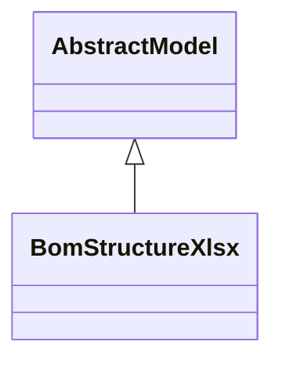

# Reports

Report definitions and templates in mrp_bom_structure_xlsx.

## Available Reports

### PDF/Document Reports
- **Export BoM Structure to Excel** (PDF/Print)

## Report Files

- **bom_structure_xlsx.py** (Python logic)
- **bom_structure_xlsx.xml** (XML template/definition)
- **__init__.py** (Python logic)

## Notes
- Named reports above are accessible through Odoo's reporting menu
- Python files define report logic and data processing
- XML files contain report templates, definitions, and formatting
- Reports are integrated with Odoo's printing and email systems
